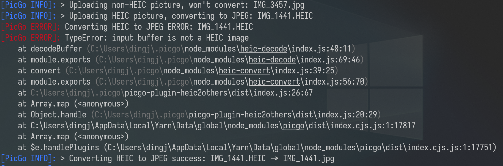
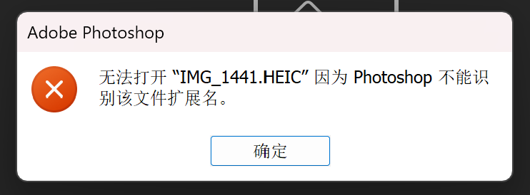

## picgo-plugin-convert-heic

Convert HEIC Photo to other formats (eg. JPEG).

Currently it only convert HEIC to JPEG with `.jpg` extension name, for uploading original photos shot by iOS devices that enable HEIC. More functions will be added if I have time.

### Usage

- Searching `convert-heic` and install it in `Plugin Settings` in PicGo GUI.
- Executing the folowing command if using PicGo CLI:

  ```bash
  picgo add convert-heic
  ```

### Note

- Some files' extension name is `.heic` but they are not HEIC format. 
  - Uploading them will cause TypeError in logs, but the extension name will be changed.
    
  - These files cannot be opened by Photoshop if keep the extension name, which is the best way for most people to tell them from other HEIC files.
    

### Thanks

- [catdad-experiments/heic-convert: 🤳 convert heic/heif images to jpeg and png](https://github.com/catdad-experiments/heic-convert), which provides the converting tool.
- [hans362/picgo-plugin-remove-exif: Remove EXIF data before uploading](https://github.com/hans362/picgo-plugin-remove-exif), which provides an easy template of the plugins of [PicGo](https://github.com/PicGo/PicGo-Core).
  - Unfortunately, the plugin is not compatibile with it, and I have no idea of how to fix it due to my lack of JavaScript, so I am looking forward to receiving pull requests of it.
